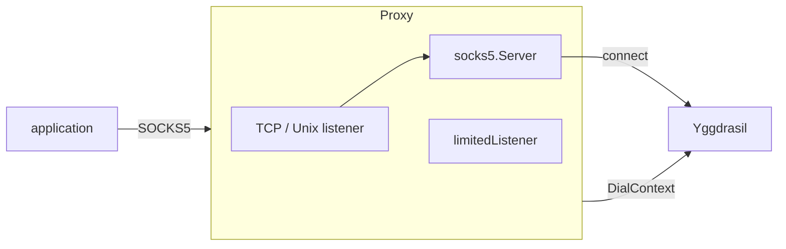
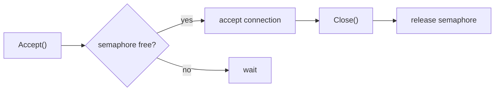

# mod/socks

SOCKS5 proxy over Yggdrasil. Allows regular applications to access the Yggdrasil network via the standard
SOCKS5 protocol.

## Contents

- [Overview](#overview)
- [Initialization](#initialization)
- [Runtime control](#runtime-control)
- [TCP and Unix socket](#tcp-and-unix-socket)
- [Connection limiting](#connection-limiting)
- [Unix socket handling](#unix-socket-handling)
- [Errors](#errors)

---

## Overview



The application connects to a SOCKS5 proxy (TCP or Unix socket), the proxy resolves the address via the provided
`NameResolver`
and establishes a connection through the Yggdrasil dialer.

---

## Initialization

```go
s, err := socks.New(socks.ConfigObj{
    Network:           node, // proxy.ContextDialer, usually core.Obj
    Addr:              "127.0.0.1:1080", // or "/tmp/ygg.sock"
    Resolver:          resolver,         // name resolver (.pk.ygg, DNS)
    Verbose:           false,
    Logger:            logger,
    MaxConnections:    100, // 0 — safe default, <0 — unlimited
    HandshakeTimeout:  10 * time.Second,
    DialTimeout:       10 * time.Second,
    TunnelIdleTimeout: 5 * time.Minute,
    Credentials:       credentials, // optional username/password auth
})
```

Creates and starts a SOCKS5 proxy. Close it with `Close`.

---

## Runtime control

```go
s.IsEnabled() // true
s.Addr()      // "127.0.0.1:1080"
s.IsUnix()    // false

s.SetMaxConnections(512)

err := s.Close() // stop and clean up
```

| Method                 | Description                          |
|------------------------|--------------------------------------|
| `Close()`              | Stops the proxy; idempotent          |
| `Addr()`               | Current listening address            |
| `IsUnix()`             | `true` if listening on a Unix socket |
| `IsEnabled()`          | `true` if the proxy is running       |
| `SetMaxConnections(n)` | Updates the active connection limit  |

`MaxConnections` is the only runtime-mutable setting. `DialTimeout` and `TunnelIdleTimeout` are immutable: set them once
via `ConfigObj` at `Start`. `TunnelIdleTimeout` uses a 5 minute safe default when set to `0`; use a negative value only
when idle tunnels must stay open indefinitely.

---

## TCP and Unix socket

The listener type is determined by the address:

| Address          | Type        |
|------------------|-------------|
| `127.0.0.1:1080` | TCP         |
| `[::1]:1080`     | TCP         |
| `/tmp/ygg.sock`  | Unix socket |
| `./local.sock`   | Unix socket |

Rule: if the address starts with `/` or `.` — Unix socket, otherwise TCP.

---

## Connection limiting

When `MaxConnections > 0`, the listener is wrapped in a `limitedListener` with a semaphore based on a buffered channel.
`MaxConnections: 0` uses the safe default (`256`); use a negative value only when an unlimited listener is intentional.



- `Accept` blocks when the limit is reached
- `Close` releases the slot exactly once (`sync.Once`)
- Repeated `Close` calls are safe

---

## Unix socket handling

On startup with a Unix socket, stale files are handled:


- If the socket is held by a live process — error
- If the socket is stale — it is removed and recreated
- Symlinks are not removed (protection against attacks)
- Socket permissions are fixed at `0600`

On `Close`, the Unix socket file is automatically removed.

---

## Errors

| Variable              | Description                                  |
|-----------------------|----------------------------------------------|
| `ErrAlreadyEnabled`   | `New` called while the proxy is already open |
| `ErrAlreadyListening` | Unix socket is held by another process       |
| `ErrSymlinkRefusal`   | Refusal to remove a symlink (safety measure) |
