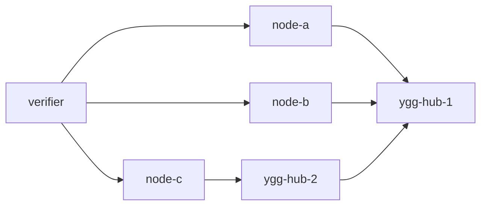

# tests

Live diagnostic harness for ratatoskr. It is intentionally small: the stack gives you real Yggdrasil
containers, ratatoskr nodes, pprof, runtime traces, and a smoke verifier, while leaving scenarios
flexible enough to run manually.

## Topology



Each ratatoskr node runs:

- diagnostic HTTP on container `:8080`;
- pprof/expvar on container `:7070`;
- SOCKS5 on container `:1080`, enabled on demand through `/socks/enable`;
- TCP echo on Yggdrasil port `80`;
- UDP echo on Yggdrasil port `18081`.

All generated state lives under `tmp/tests`.

## Run Manually

```bash
bash tests/scripts/up.sh
```

Host ports:

- node-a: `http://127.0.0.1:18080`, pprof `http://127.0.0.1:16080/debug/pprof/`
- node-b: `http://127.0.0.1:18081`, pprof `http://127.0.0.1:16081/debug/pprof/`
- node-c: `http://127.0.0.1:18082`, pprof `http://127.0.0.1:16082/debug/pprof/`

Useful manual calls:

```bash
curl -s http://127.0.0.1:18080/health | jq
curl -s http://127.0.0.1:18080/snapshot | jq
curl -s http://127.0.0.1:18080/runtime | jq
curl -s http://127.0.0.1:16080/debug/pprof/goroutine?debug=1
curl -o tmp/tests/node-a.cpu.pprof 'http://127.0.0.1:16080/debug/pprof/profile?seconds=10'
curl -o tmp/tests/node-a.trace 'http://127.0.0.1:16080/debug/pprof/trace?seconds=5'
```

Run a load from node-a to node-b after reading node-b's Yggdrasil address from `/health`:

```bash
ADDR=$(curl -s http://127.0.0.1:18081/health | jq -r .address)
curl -s -H 'Content-Type: application/json' \
  -d "{\"address\":\"[${ADDR}]:18080\",\"size\":1024,\"seconds\":30,\"streams\":8}" \
  http://127.0.0.1:18080/load/tcp | jq
```

Enter a container:

```bash
docker compose -f tests/docker-compose.yml exec node-a bash
```

## Smoke Verifier

```bash
bash tests/scripts/up.sh --verify
```

`--verify` starts the stack, waits for health and peers, runs TCP/UDP/SOCKS/pprof checks, captures a CPU
profile and runtime trace, then always stops the compose stack. By default it also removes `tmp/tests`
after the run so no runtime state remains.

Keep generated results for inspection:

```bash
bash tests/scripts/up.sh --verify --keep-state
```

Reuse already-built Docker images:

```bash
bash tests/scripts/up.sh --no-build --verify --keep-state
```

Reuse per-node diagnostic binaries under `tmp/tests/node-*/bin`:

```bash
bash tests/scripts/up.sh --no-build --no-rebuild
```

## Stop And Clean

```bash
bash tests/scripts/down.sh
bash tests/scripts/down.sh --clean
bash tests/scripts/down.sh --clean --prune
```

- `down.sh` removes containers and the compose network.
- `--clean` also removes `tmp/tests`.
- `--prune` removes the `rts-*` test images and prunes BuildKit cache.

Use `--clean --prune` when you want the test environment to leave no containers, network, generated
state, or test images behind.
