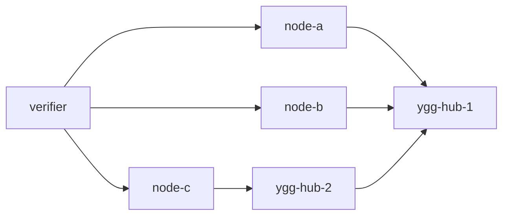

# tests

Live diagnostic harness for ratatoskr. It is intentionally small: the stack gives you real Yggdrasil
containers, ratatoskr nodes, pprof, runtime traces, and a smoke verifier, while leaving scenarios
flexible enough to run manually.

## Topology



Each ratatoskr node runs:

- diagnostic HTTP on container `:8080`;
- pprof/expvar on container `:7070`;
- SOCKS5 on container `:1080`, enabled on demand through `/socks/enable`;
- TCP echo on Yggdrasil port `80`;
- UDP echo on Yggdrasil port `18081`.
- direct and Yggdrasil TCP/UDP throughput sinks on ports `19080` and `19081`.

All generated state lives under `tmp/tests`.

## Run Manually

```bash
bash tests/scripts/up.sh
```

Host ports:

- node-a: `http://127.0.0.1:18080`, pprof `http://127.0.0.1:16080/debug/pprof/`
- node-b: `http://127.0.0.1:18081`, pprof `http://127.0.0.1:16081/debug/pprof/`
- node-c: `http://127.0.0.1:18082`, pprof `http://127.0.0.1:16082/debug/pprof/`

Useful manual calls:

```bash
curl -s http://127.0.0.1:18080/health | jq
curl -s http://127.0.0.1:18080/snapshot | jq
curl -s http://127.0.0.1:18080/runtime | jq
curl -s http://127.0.0.1:16080/debug/pprof/goroutine?debug=1
curl -o tmp/tests/node-a.cpu.pprof 'http://127.0.0.1:16080/debug/pprof/profile?seconds=10'
curl -o tmp/tests/node-a.trace 'http://127.0.0.1:16080/debug/pprof/trace?seconds=5'
```

Run a load from node-a to node-b after reading node-b's Yggdrasil address from `/health`:

```bash
ADDR=$(curl -s http://127.0.0.1:18081/health | jq -r .address)
curl -s -H 'Content-Type: application/json' \
  -d "{\"address\":\"[${ADDR}]:18080\",\"size\":1024,\"seconds\":30,\"streams\":8}" \
  http://127.0.0.1:18080/load/tcp | jq
```

Enter a container:

```bash
docker compose -f tests/docker-compose.yml exec node-a bash
```

## Smoke Verifier

```bash
bash tests/scripts/up.sh --verify
```

`--verify` starts the stack, waits for health and peers, runs TCP/UDP/SOCKS/pprof checks, captures a CPU
profile and runtime trace, then always stops the compose stack. By default it also removes `tmp/tests`
after the run so no runtime state remains.

Keep generated results for inspection:

```bash
bash tests/scripts/up.sh --verify --keep-state
```

Reuse already-built Docker images:

```bash
bash tests/scripts/up.sh --no-build --verify --keep-state
```

Reuse per-node diagnostic binaries under `tmp/tests/node-*/bin`:

```bash
bash tests/scripts/up.sh --no-build --no-rebuild
```

## Throughput Diagnostics

```bash
bash tests/scripts/up.sh --throughput --keep-state
```

This separate, intentionally resource-intensive mode measures one-way TCP and UDP traffic from node-a to node-b over
both the Docker bridge and Ratatoskr/Yggdrasil. For 1, 4, and 16 streams it discards a five-second warm-up, performs
three
independent twenty-second measurements, and selects the best concurrency by median receiver goodput. Direct and
Yggdrasil repetitions use alternating AB/BA order to reduce systematic thermal and background-load bias. UDP results
include sender rate, receiver goodput, packet loss, duplicates, reordering, and packets that arrived outside the bounded
sequence window.

The same run then measures CPU scaling at `GOMAXPROCS` 1, 2, 4, and 8, omitting values unavailable on the host. Each
protocol keeps the Yggdrasil-selected stream count fixed at every CPU value and repeats both direct and Yggdrasil paths,
so concurrency changes cannot be mistaken for CPU scaling. The summary reports median/min/max/mean, relative range,
Yggdrasil/direct, speedup from one CPU, and scaling efficiency. Here "CPU" means Go scheduler parallelism for the
complete embedded Ratatoskr/Yggdrasil edge process, including its diagnostic sender or sink; it does not mean dedicated
physical cores. Direct results at the same setting provide the normalization baseline.

Scaling efficiency can exceed 100% when the one-CPU point is scheduler-starved rather than merely compute-limited. In
that case, treat the discontinuity as evidence that the workload needs at least two runnable scheduler contexts, not as
linear or superlinear algorithmic scaling.

There is no fixed throughput or loss threshold because host CPU, Docker, and MTU differ. A case fails only when no data
arrives or its control/data path fails. A relative range above 10% is reported as instability but does not fail the run.
The default benchmark can saturate CPU and network for approximately 35 to 40 minutes, including readiness and profile
collection.

Results are written only to `tmp/tests/results/throughput`:

```text
summary.json
baseline/
cpu-scaling/
profiles/
```

`summary.json` compares median Yggdrasil receiver goodput with the direct Docker baseline for each protocol and includes
the complete CPU-scaling curves. Raw warm-up, repetition, sender, receiver, and condition JSON remains in the respective
directories.

Profiles and traces are captured in separate runs and never contribute to clean throughput statistics. Omit
`--keep-state` to remove all generated state automatically. Bounded parameters can be overridden for shorter diagnostic
runs with `THROUGHPUT_WARMUP_SECONDS`, `THROUGHPUT_MEASURE_SECONDS`, `THROUGHPUT_REPETITIONS`,
`THROUGHPUT_PROFILE_SECONDS`, `THROUGHPUT_STREAMS`, `THROUGHPUT_CPU_VALUES`,
`THROUGHPUT_STABILITY_WARN_PERCENT`, `THROUGHPUT_TCP_PAYLOAD`, and `THROUGHPUT_UDP_PAYLOAD`.

The diagnostic nodes expose a guarded `POST /runtime/gomaxprocs` endpoint used by the runner. `{"value":N}` applies a
process-global override and `{"restore":true}` restores the startup runtime policy. If `RTS_DIAG_TOKEN` is empty, all
mutation endpoints are unauthenticated; do not expose the diagnostic HTTP listener to an untrusted network because
repeated scheduler changes can degrade the entire process.

Open a captured profile or trace, for example:

```bash
go tool pprof -http=:0 tmp/tests/node-a/bin/ratatoskr-diag \
  tmp/tests/results/throughput/profiles/baseline/tcp-ygg/sender-cpu.pprof
go tool trace tmp/tests/results/throughput/profiles/baseline/tcp-ygg/sender-trace.out
```

## Stop And Clean

```bash
bash tests/scripts/down.sh
bash tests/scripts/down.sh --clean
bash tests/scripts/down.sh --clean --prune
```

- `down.sh` removes containers and the compose network.
- `--clean` also removes `tmp/tests`.
- `--prune` removes the `rts-*` test images and prunes BuildKit cache.

Use `--clean --prune` when you want the test environment to leave no containers, network, generated
state, or test images behind.
