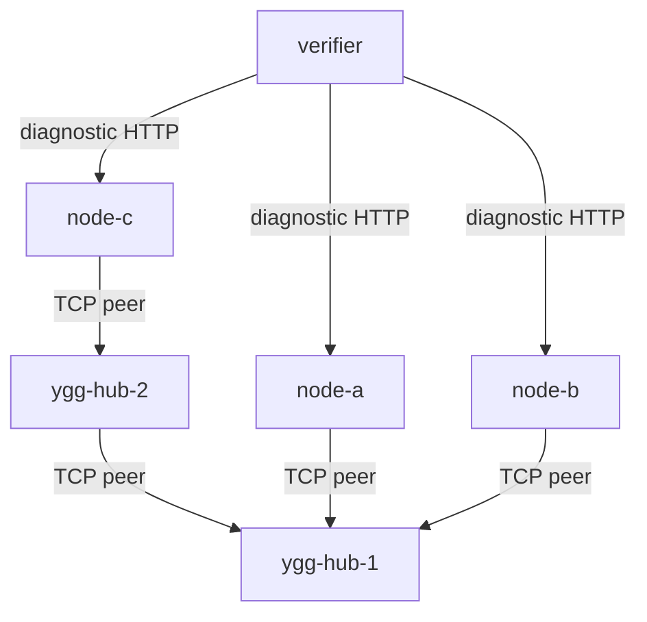

# Live test environment

This directory contains the container-based integration, diagnostics, profiling, and throughput environment. It runs
three Ratatoskr nodes over two Yggdrasil hubs and stores all generated state under `tmp/tests`.

## Contents

- [What it verifies](#what-it-verifies)
- [Topology](#topology)
- [Quick start](#quick-start)
- [Services and host ports](#services-and-host-ports)
- [Smoke verification](#smoke-verification)
- [Throughput diagnostics](#throughput-diagnostics)
- [Profiles and traces](#profiles-and-traces)
- [Generated state and cleanup](#generated-state-and-cleanup)
- [Directory guide](#directory-guide)

## What it verifies

The environment exercises behavior that unit tests cannot reproduce faithfully:

- Yggdrasil peer establishment across one-hop and two-hop paths;
- Ratatoskr TCP and UDP listeners and dials;
- SOCKS5 TCP and UDP ASSOCIATE traffic;
- shutdown and runtime snapshots;
- pprof and runtime trace collection under load;
- direct Docker versus Ratatoskr/Yggdrasil TCP and UDP throughput;
- throughput scaling at controlled `GOMAXPROCS` values.

The harness is diagnostic, not a stable performance gate. Host load, CPU topology, Docker, kernel settings, and MTU
affect the measurements.

## Topology



`node-a` and `node-b` test the single-hub path. `node-c` adds the second hub so smoke checks also observe a routed
topology.

## Quick start

Requirements:

- Docker with Compose v2;
- Bash;
- enough free CPU and disk space to build three test images and the Go module cache.

Start the stack:

```bash
bash tests/scripts/up.sh
```

Run the complete smoke suite and remove generated state afterward:

```bash
bash tests/scripts/up.sh --verify
```

Keep results for inspection:

```bash
bash tests/scripts/up.sh --verify --keep-state
```

Reuse images and the per-node diagnostic binaries:

```bash
bash tests/scripts/up.sh --no-build --no-rebuild
```

## Services and host ports

Each diagnostic node exposes these container ports:

| Service                       | Container port | Purpose                                      |
|-------------------------------|---------------:|----------------------------------------------|
| Diagnostic HTTP               |           8080 | Health, snapshots, checks, load, and control |
| Debug HTTP                    |           7070 | pprof and expvar                             |
| SOCKS5                        |           1080 | Enabled on demand                            |
| Yggdrasil TCP echo            |             80 | End-to-end stream checks                     |
| Yggdrasil UDP echo            |          18081 | End-to-end datagram checks                   |
| Direct and Yggdrasil TCP sink |          19080 | One-way throughput                           |
| Direct and Yggdrasil UDP sink |          19081 | One-way throughput and loss accounting       |

Host bindings are loopback-only:

| Node   | Diagnostic HTTP   | Debug HTTP        | SOCKS5            |
|--------|-------------------|-------------------|-------------------|
| node-a | `127.0.0.1:18080` | `127.0.0.1:16080` | `127.0.0.1:11080` |
| node-b | `127.0.0.1:18081` | `127.0.0.1:16081` | `127.0.0.1:11081` |
| node-c | `127.0.0.1:18082` | `127.0.0.1:16082` | `127.0.0.1:11082` |

Examples:

```bash
curl -fsS http://127.0.0.1:18080/health | jq
curl -fsS http://127.0.0.1:18080/snapshot | jq
curl -fsS http://127.0.0.1:18080/runtime | jq
```

The full diagnostic HTTP contract is documented in [diag/README.md](diag/README.md).

## Smoke verification

```bash
bash tests/scripts/up.sh --verify --keep-state
```

Hard checks fail the command. They cover node readiness, an active peer on every node, TCP echo, 512-byte UDP echo,
SOCKS5 TCP and UDP paths, pprof, and trace capture. The 4096-byte UDP echo and the short synthetic TCP load are
diagnostics: their failure is recorded but does not hide the result of the basic data-path checks. The TCP echo check
allows 120 seconds for route convergence and remains a hard failure after that deadline.

Results are written to `tmp/tests/results/smoke`. See [verifier/README.md](verifier/README.md) for every check and
output file.

## Throughput diagnostics

```bash
bash tests/scripts/up.sh --throughput --keep-state
```

The default run:

- tests TCP and UDP over both the Docker bridge and Ratatoskr/Yggdrasil;
- evaluates 1, 4, and 16 streams;
- discards a 5-second warm-up;
- records three independent 20-second measurements;
- alternates direct/Yggdrasil order between repetitions;
- evaluates `GOMAXPROCS` 1, 2, 4, and 8 when available;
- captures profiles and traces in separate runs so instrumentation does not contaminate throughput samples.

The default run takes approximately 35 to 40 minutes and can saturate the available CPU and network. It has no fixed
throughput threshold. A case fails when the control path fails or the receiver gets no data; a relative range above 10%
is reported as instability.

Results are stored under `tmp/tests/results/throughput`:

```text
summary.json
baseline/
cpu-scaling/
profiles/
```

The methodology, environment overrides, result schema, and interpretation rules are documented
in [verifier/README.md](verifier/README.md#throughput-runner).

## Profiles and traces

The debug listener is enabled by the generated container configuration. Capture data manually:

```bash
curl -o tmp/tests/node-a.cpu.pprof \
  'http://127.0.0.1:16080/debug/pprof/profile?seconds=10'
curl -o tmp/tests/node-a.trace \
  'http://127.0.0.1:16080/debug/pprof/trace?seconds=5'
```

Open throughput artifacts against the exact diagnostic binary used by the run:

```bash
go tool pprof -http=:0 \
  tmp/tests/node-a/bin/ratatoskr-diag \
  tmp/tests/results/throughput/profiles/baseline/tcp-ygg/sender-cpu.pprof

go tool trace \
  tmp/tests/results/throughput/profiles/baseline/tcp-ygg/sender-trace.out
```

## Generated state and cleanup

All generated configuration, Go caches, binaries, profiles, traces, and results live under `tmp/tests`. Nothing
generated by this environment belongs in Git.

Stop containers while keeping state:

```bash
bash tests/scripts/down.sh
```

Stop containers and remove `tmp/tests`:

```bash
bash tests/scripts/down.sh --clean
```

Also remove the three `rts-*` images and prune BuildKit cache:

```bash
bash tests/scripts/down.sh --clean --prune
```

## Directory guide

- [diag](diag/README.md): diagnostic node process, endpoints, limits, and unit tests.
- [scripts](scripts/README.md): stack bootstrap, startup, teardown, and state ownership.
- [verifier](verifier/README.md): smoke checks, throughput methodology, and result files.
- [docker-compose.yml](docker-compose.yml): topology and loopback host bindings.
- `*.Dockerfile` and `*-entrypoint.sh`: disposable container images and entrypoints.
