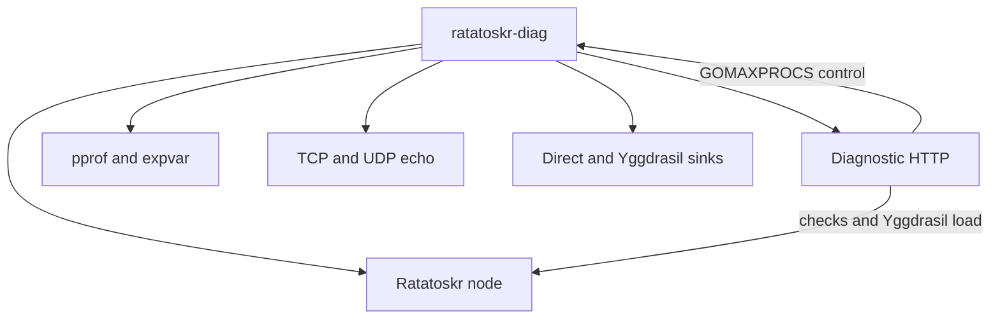

# Diagnostic node

`tests/diag` builds a test-only Ratatoskr node with echo services, bounded load generation, one-way throughput sinks,
runtime controls, and optional pprof/expvar exposure. It is a `package main` used by the container harness, not a
reusable module.

## Contents

- [Responsibilities](#responsibilities)
- [Build and run](#build-and-run)
- [Configuration](#configuration)
- [HTTP API](#http-api)
- [Safety boundaries](#safety-boundaries)
- [Throughput protocol](#throughput-protocol)
- [Source layout](#source-layout)
- [Unit tests](#unit-tests)

## Responsibilities



The process owns one Ratatoskr node and closes it before waiting for its listeners and HTTP servers. It can measure
direct container traffic and Yggdrasil traffic with the same sender and receiver implementation.

## Build and run

Build from the repository root:

```bash
GOWORK=off go build -o tmp/ratatoskr-diag ./tests/diag
```

Run with a JSON configuration:

```bash
tmp/ratatoskr-diag -config tmp/tests/node-a/config.json
```

The container entrypoint normally performs this build and passes `/data/config.json`.
Use [../scripts/bootstrap.sh](../scripts/bootstrap.sh) to generate the three standard configurations under `tmp/tests`.

## Configuration

| JSON field              | Default              | Meaning                                     |
|-------------------------|----------------------|---------------------------------------------|
| `name`                  | `ratatoskr-node`     | Diagnostic node name                        |
| `peers`                 | empty                | Yggdrasil peer URIs                         |
| `if_mtu`                | Yggdrasil default    | Interface MTU override                      |
| `http_listen`           | `127.0.0.1:8080`     | Diagnostic HTTP listener                    |
| `debug_listen`          | `127.0.0.1:7070`     | pprof/expvar listener                       |
| `debug_enabled`         | `false`              | Enable pprof/expvar                         |
| `socks_listen`          | `127.0.0.1:1080`     | SOCKS5 listener used by the enable endpoint |
| `socks_max_connections` | SOCKS module default | SOCKS5 connection limit                     |
| `tcp_echo_port`         | `18080`              | Yggdrasil TCP echo port                     |
| `udp_echo_port`         | `18081`              | Yggdrasil UDP echo port                     |
| `tcp_throughput_port`   | `19080`              | Direct and Yggdrasil TCP sink port          |
| `udp_throughput_port`   | `19081`              | Direct and Yggdrasil UDP sink port          |
| `results_dir`           | `/data/results`      | Result directory exposed in configuration   |
| `close_timeout`         | `10s`                | Root Ratatoskr close budget                 |

`RTS_DIAG_DEBUG` enables the debug listener regardless of `debug_enabled`. Generated container configs bind HTTP, debug,
and SOCKS listeners to `0.0.0.0`; Docker publishes them only on host loopback.

## HTTP API

Read-only endpoints:

| Method      | Path         | Result                                                            |
|-------------|--------------|-------------------------------------------------------------------|
| GET         | `/health`    | Identity, MTU, uptime, and echo/sink addresses                    |
| GET         | `/snapshot`  | Ratatoskr snapshot                                                |
| GET         | `/runtime`   | Go version, memory counters, goroutines, CPU state, and listeners |
| GET or POST | `/check/tcp` | One TCP echo operation                                            |
| GET or POST | `/check/udp` | One UDP echo operation                                            |

State-changing endpoints accept only POST:

| Path                  | Purpose                                      |
|-----------------------|----------------------------------------------|
| `/load/tcp`           | Bounded concurrent TCP echo load             |
| `/load/udp`           | Bounded concurrent UDP echo load             |
| `/throughput/start`   | Create a receiver accounting window          |
| `/throughput/run`     | Send one-way direct or Yggdrasil traffic     |
| `/throughput/finish`  | Stop accounting and return receiver counters |
| `/runtime/gomaxprocs` | Set or restore process-wide `GOMAXPROCS`     |
| `/socks/enable`       | Start the configured SOCKS5 listener         |
| `/socks/disable`      | Stop SOCKS5                                  |
| `/close`              | Cancel the diagnostic process                |

When `RTS_DIAG_TOKEN` is non-empty, every state-changing request must include the same value in `X-Diag-Token`. The
comparison is constant-time. With an empty token, mutation endpoints are unauthenticated; do not expose this listener to
an untrusted network.

Example:

```bash
curl -fsS -H 'Content-Type: application/json' \
  -d '{"address":"[200::1]:18080","size":1024,"seconds":10,"streams":4}' \
  http://127.0.0.1:18080/load/tcp | jq
```

## Safety boundaries

The diagnostic API bounds caller-controlled work:

| Resource                        |      Maximum |
|---------------------------------|-------------:|
| JSON request body               |       64 KiB |
| Echo payload                    |        1 MiB |
| Synthetic-load payload          |        1 MiB |
| Synthetic-load streams          |           64 |
| Synthetic-load duration         |   60 seconds |
| Per-operation timeout           |   60 seconds |
| Throughput streams              |           32 |
| Throughput duration per request |   30 seconds |
| TCP throughput payload          |        1 MiB |
| UDP throughput payload          | 65,499 bytes |
| Concurrent receiver runs        |           32 |
| Receiver-run lifetime           |    2 minutes |

These bounds prevent a single request from allocating unbounded memory or goroutines. The diagnostic service remains
capable of saturating CPU and network by design.

## Throughput protocol

Each receiver run uses a 16-byte random identifier encoded as 32 hexadecimal characters. TCP streams send a 28-byte
header once, followed by payload bytes. UDP datagrams send a 36-byte header containing the run identifier, stream
identifier, and sequence number.

The UDP receiver maintains a 4,096-packet sequence window per stream and reports:

- unique payload bytes and packets;
- duplicates;
- reordered packets still inside the window;
- packets older than the current window.

Receiver goodput is authoritative because sender completion does not prove that UDP packets arrived. TCP counts only
payload bytes after a valid stream header.

## Source layout

- [main.go](main.go): process construction and shutdown.
- [config.go](config.go): JSON configuration and defaults.
- [server.go](server.go): listener ownership and endpoint registration.
- [handlers.go](handlers.go): common JSON responses and lifecycle controls.
- [checks.go](checks.go): echo checks and bounded request/response load.
- [echo.go](echo.go): Yggdrasil TCP and UDP echo services.
- [runtime.go](runtime.go): runtime snapshot and `GOMAXPROCS` controller.
- [throughput_protocol.go](throughput_protocol.go): wire headers, run registry, and UDP sequence accounting.
- [throughput_sender.go](throughput_sender.go): one-way load generation.
- [throughput_sink.go](throughput_sink.go): direct and Yggdrasil receivers.

## Unit tests

Run the package checks:

```bash
GOWORK=off go test -count=10 -shuffle=on ./tests/diag
CGO_ENABLED=1 GOWORK=off go test -race -count=3 -shuffle=on ./tests/diag
```

The tests cover protocol round trips and rejection, UDP duplicate/reorder/window accounting, registry creation and
finalization, TCP payload accounting, partial writes, request bounds, and process-wide `GOMAXPROCS` restoration.
End-to-end network behavior belongs to the container verifier rather than unit-test mocks.
